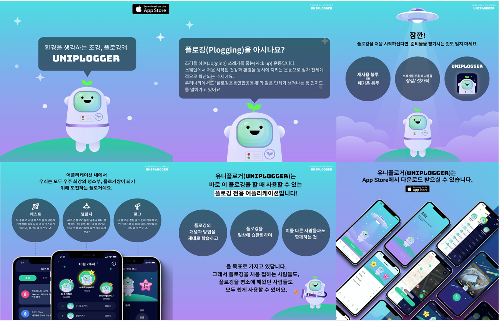

# 유니플로거(Uniplogger)
환경을 생각하는 조깅, 플로깅앱 유니플로거 

## Intro
- 유니플로거는 조깅을 하며(Jogging) 쓰레기를 줍는(Pick Up) 환경운동인 플로깅(Plogging)에 재미요소를 가미하여 일상에서 환경운동에 동참할 수 있도록 돕는 앱서비스입니다.<br>


## Tech Stack
Back-end : DRF(Django Rest Framework)

## Getting Started
-앱스토어 링크
```
apple.co/3hyzc7k
```
-배포 주소
```
http://49.50.174.68/users/
```
-API 문서
```
http://128.0.0.1:8000/swagger

```

